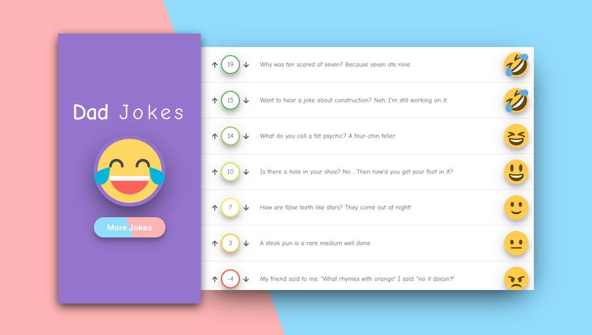

# ICANHAZDADJOKES

## Developed as part of an React Lifecycle exercise in the Colt Steele React course

Dad jokes API using axios and various React lifecycle methods to fetch, render and update jokes.

Emoji's are dynamic and change depending on the votes a joke has received.

Jokes data is stored in localStorage.

* CSS credits to Colt Steele [Codepen](https://codepen.io/Colt) - [Github](https://github.com/Colt)
